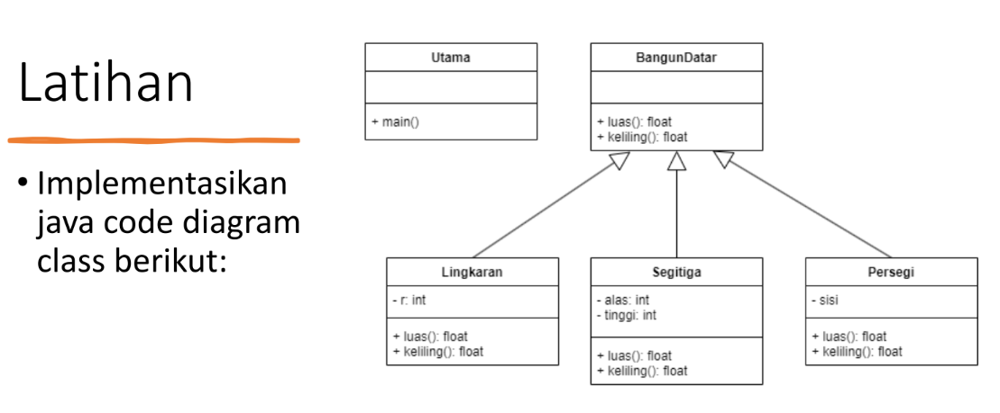
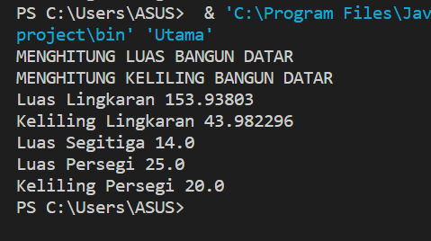

# Praktikum-4
<h3> Nama : Viena Dwi Putri Maulina </h3>
<h3> Nim : 312110469 </h3>
<h3> Kelas : TI.21.C1 </h3>
<h3> Mata Kuliah : Pemrograman Orientasi Objek</h3>
<h3> Tugas Pertemuan 7 </h3>
<h3> Polimorfisme <h3>
<br>
<p> Berikut soal latihannya </p>



<p> Jawab <p>
<p> file BangunDatar.java<p>

```java
public class BangunDatar {
    float luas(){
        System.out.println("MENGHITUNG LUAS BANGUN DATAR");
        return 0;
    }

    float keliling(){
        System.out.println("MENGHITUNG KELILING BANGUN DATAR");
        return 0;
    }
}
```
<br>
<p> Lingkaran.java <p>

```java
public class Lingkaran extends BangunDatar {
    int r;
    public Lingkaran(int r){
        this.r = r;
    }

    public float luas(){
        return (float)(Math.PI*r*r);
    }

    public float keliling(){
        return (float)(2*Math.PI*r);
    }
}
    
```
<br>
<p> Persegi.java <p>

```java
public class Persegi {
    int sisi;

    public Persegi(int sisi){
        this.sisi = sisi;
    }

    public float luas(){
        return this.sisi*this.sisi;
    }

    public float keliling(){
        return this.sisi*4;
    }
}
```
<br>
<p> file segitiga <p>

```java
public class Segitiga extends BangunDatar{
    int alas;
    int tinggi;

    public Segitiga(int alas, int tinggi){
        this.alas = alas;
        this.tinggi = tinggi;
    }

    public float luas(){
        return this.alas*this.tinggi*1/2;
    }
}
```
<br>
<p> file Utama.java <p>

```java
public class Utama extends BangunDatar{
    public static void main(String[] args) {
        BangunDatar bangunDatar = new BangunDatar();
        Lingkaran lingkaran = new Lingkaran(7); 
        Segitiga segitiga = new Segitiga(4,7);
        Persegi persegi = new Persegi(5);

    //memanggil method luas dan keliling
    bangunDatar.luas();
    bangunDatar.keliling();

    System.out.println("Luas Lingkaran "+lingkaran.luas());
    System.out.println("Keliling Lingkaran "+lingkaran.keliling());
    System.out.println("Luas Segitiga "+segitiga.luas());
    System.out.println("Luas Persegi "+persegi.luas());
    System.out.println("Keliling Persegi "+persegi.keliling());
    }
}
```
<br>
<p> Output nya sebagai berikut <p>


